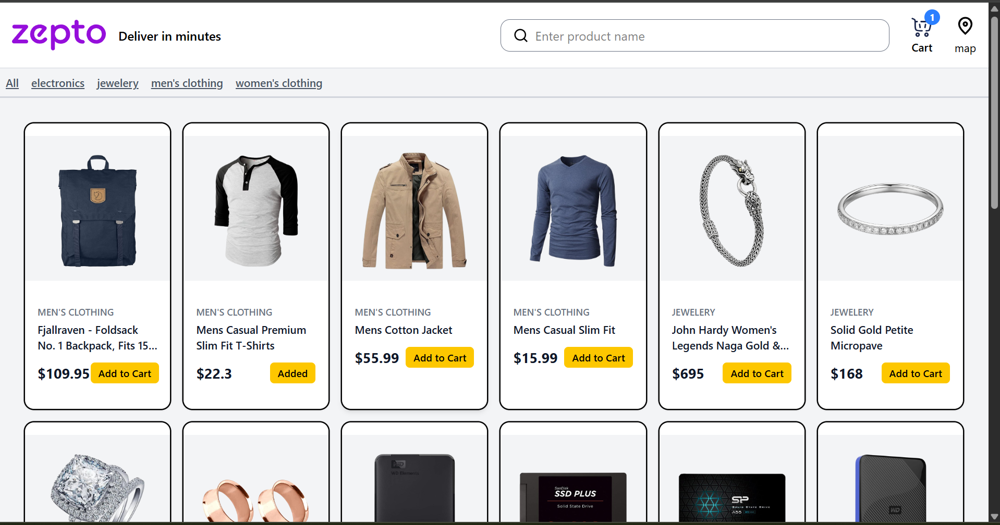
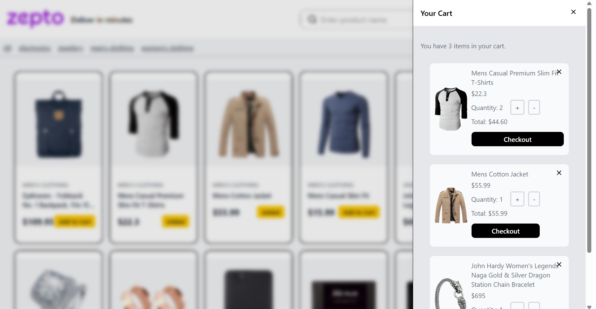

# Andro Buddy

## Setup guide

**Prerequisites:** Node.js 18+ and npm.

1. Install dependencies:
   ```bash
   npm install
   ```
2. Start the dev server:
   ```bash
   npm run dev
   ```
   The app runs at `http://localhost:5173`.
3. Other scripts:
   ```bash
   npm run build     # type-check and build for production
   npm run preview   # preview the production build
   npm run lint       # run ESLint
   ```

## State management choice explanation

Cart state is managed with React's built-in **Context API** (`src/context/cartContext.tsx`), combined with `useState` and `useEffect`.

- **Scope of state is small:** the app only needs to share one piece of state (the cart) across a few components (`Navbar`, `ProductCard`, `CartSheet`), so a dedicated state library would add complexity without real benefit.
- **No extra dependencies:** Context + hooks are built into React, keeping the bundle smaller and avoiding boilerplate (actions, reducers, stores) that libraries like Redux require.
- **Persistence via localStorage:** the provider reads the cart from `localStorage` on init and writes back to it on every change, so the cart survives page refreshes without needing middleware.
- **Simple update logic:** cart operations (add, remove, increase/decrease quantity) are plain functions exposed through context, which is easy to reason about at this app's size.

If the app's shared state grows significantly (more domains beyond the cart, more complex async flows), a dedicated library would be worth revisiting.

## Screen shots

### Home Page



### Cart Open



